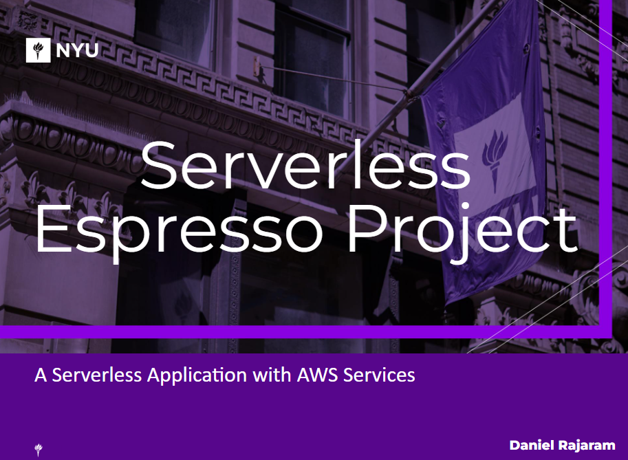
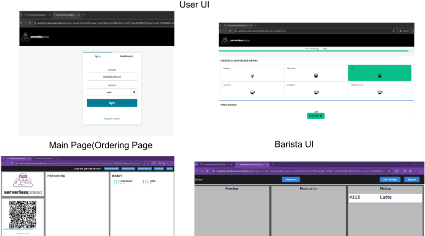
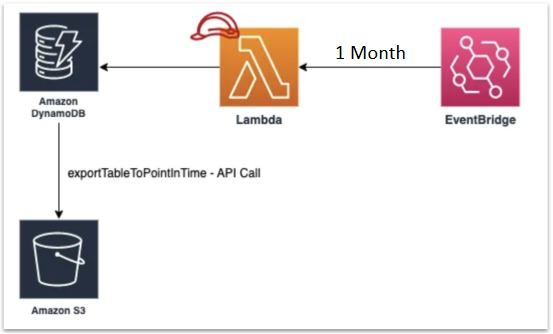
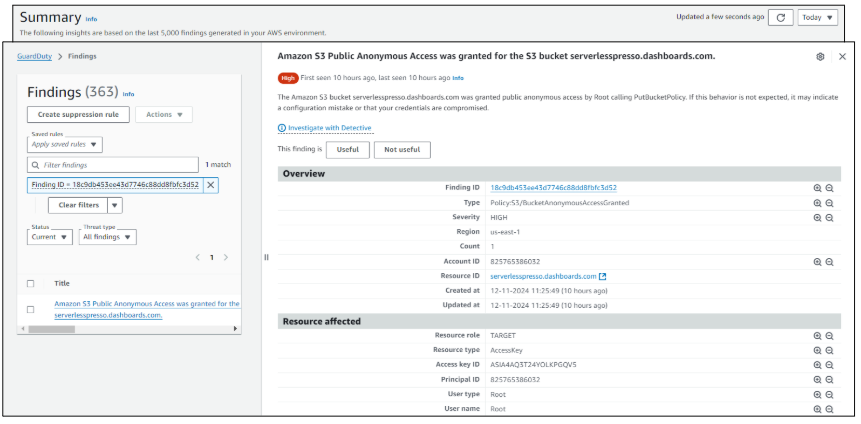
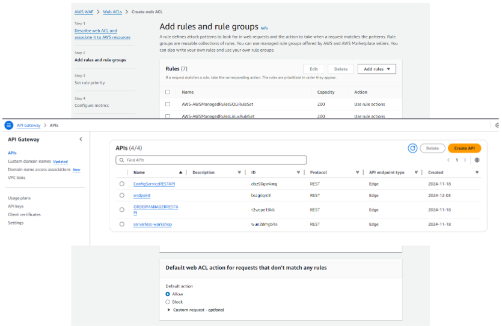

# Serverless Espresso Project

## Overview
The Serverless Espresso Project simulates a coffee ordering system using a serverless architecture on AWS. It is designed to efficiently handle coffee orders while maintaining cost-effectiveness and scalability. This project demonstrates a practical implementation of various AWS services to create a fully functional, secure, and monitored application.

## Architecture and Workflow
The project leverages multiple AWS services to create a seamless experience for both users and administrators. Below is a high-level description of the architecture:

1. **Frontend:** A React application deployed using AWS Amplify provides a user-friendly interface for coffee ordering.
2. **API Gateway:** RESTful APIs are created to facilitate communication between the frontend, backend, and database.
3. **AWS Lambda:** Handles the backend logic for processing coffee orders and other workflows.
4. **AWS Step Functions:** Orchestrates the workflow, ensuring reliable execution and visibility into order progress.
5. **Amazon DynamoDB:** Stores order details for quick and efficient data retrieval.
6. **Amazon SNS:** Sends notifications about order status to customers and administrators.
7. **Amazon CloudWatch:** Monitors application performance, logs errors, and provides dashboards for analytics.

---

## AWS Services and Their Functions

### **1. AWS Lambda**
- **Purpose:** Executes the core logic of the application, such as processing orders and sending notifications.
- **Skills Obtained:**
  - Writing and deploying Node.js-based serverless functions.
  - Managing triggers and events for Lambda functions.

  

### **2. Amazon API Gateway**
- **Purpose:** Acts as a bridge between the frontend and backend, enabling secure communication.
- **Key Features:**
  - Provides RESTful endpoints.
  - Integrates with Cognito for authentication and authorization.
  - Example endpoint: `POST /qr-code` to start the order workflow.
- **Skills Obtained:**
  - Configuring API Gateway endpoints.
  - Setting up security mechanisms like authentication and rate limiting.

### **3. Amazon DynamoDB**
- **Purpose:** A NoSQL database for storing and managing order data.
- **Key Features:**
  - Fast and scalable storage.
  - Supports automatic scaling based on traffic.
- **Skills Obtained:**
  - Designing DynamoDB tables and indexes.
  - Automating backups to S3 using Lambda and EventBridge.

    

### **4. AWS Step Functions**
- **Purpose:** Orchestrates the sequence of steps involved in order processing.
- **Key Features:**
  - Defines workflows using JSON-based state machines.
  - Provides visibility into execution status.
- **Skills Obtained:**
  - Designing and deploying workflows.
  - Integrating Step Functions with other AWS services.

  

### **5. Amazon SNS**
- **Purpose:** Sends notifications about coffee orders and system anomalies.
- **Key Features:**
  - Sends alerts to baristas and administrators.
  - Tracks order statuses and system errors.
- **Skills Obtained:**
  - Setting up notification topics and subscriptions.
  - Configuring notifications based on CloudWatch alarms.

  
  

### **6. Amazon CloudWatch**
- **Purpose:** Monitors application health and logs system events.
- **Key Features:**
  - Provides dashboards for real-time metrics.
  - Creates alarms for anomalies like high latency or API failures.
- **Skills Obtained:**
  - Creating dashboards and alarms.
  - Querying logs for debugging.

    
  
    

### **7. AWS Amplify**
- **Purpose:** Deploys the frontend React application.
- **Key Features:**
  - Simplifies hosting and continuous integration.
  - Provides authentication support.
- **Skills Obtained:**
  - Deploying and managing frontend applications.
  - Using Amplify CLI for configuration.

### **8. AWS GuardDuty and WAF**
- **GuardDuty:** Detects and alerts on malicious activities and vulnerabilities.
- **WAF:** Protects against common web attacks like SQL injection and XSS.
- **Skills Obtained:**
  - Configuring and integrating security services.
  - Writing custom rules for WAF.

      
      

---

## Deployment
The infrastructure is provisioned using **AWS CloudFormation**, ensuring repeatable and reliable deployment of:
- Lambda functions
- API Gateway endpoints
- DynamoDB tables

**Skills Obtained:**
- Writing CloudFormation templates.
- Managing infrastructure as code.

---

## Challenges Encountered
1. **AWS SES Sandbox Limitations:** Verifying sender and recipient email addresses was restrictive.
2. **SNS Flexibility:** Dynamic email workflows required creative solutions.
3. **CloudWatch Queries:** Writing efficient Log Insights queries was challenging but improved over time with practice.

---

## Future Enhancements
- Add drink customization features.
- Introduce multi-language support.
- Implement voice ordering with Alexa.
- Utilize predictive scaling for traffic management.

---

## What I Learned
1. **AWS Services Mastery:**
   - Practical knowledge of serverless architecture.
   - Integrating multiple AWS services to create a cohesive application.
2. **Cloud Monitoring and Security:**
   - Leveraging CloudWatch for operational insights.
   - Securing applications with GuardDuty and WAF.
3. **Deployment Automation:**
   - Using CloudFormation to manage infrastructure.

---

## Skills Demonstrated
- **Cloud Computing:** Extensive experience with AWS services like Lambda, API Gateway, and DynamoDB.
- **Security:** Implementing GuardDuty and WAF for threat detection and protection.
- **Monitoring:** Creating dashboards and alarms in CloudWatch.
- **Serverless Architecture:** Designing scalable and cost-effective applications.
- **Collaboration:** Managing a project with multiple components and services.

This project provided invaluable experience in building, managing and securing cloud-based applications using AWS.
